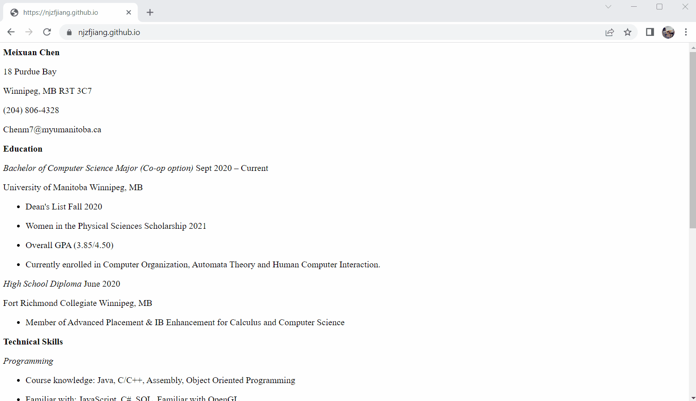

# How to host your Resume on Github Pages

This readme walks through a detailed procedure on how to host your 
customized Resume on Github Pages. The process will involve the usage
of markdown, markdown editor, Jerkyll and Github Pages; and also follows the
procedures described in Andrew Etter's book [_Modern Technical Writing_](#more-resources).

## Prerequisites
- A Github Account
- Resume in markdown format
## Instructions
### Step 1: Create your own Resume
Write your Resume using Markdown. The result file should end in 
".md" or ".markdown". 
- Using Light weighted markup language prevents the writer from having to learn the details of XML, which might be a road block on creating content.
- See the [More Resources](#more-resources) Section for tutorials on markdown.

### Step 2: Installing Jekyll
Once your resume is ready to go, Install [Jekyll](https://jekyllrb.com/docs/) 
following the guide provided on the website.
- Jekyll is an easy-to-use static site generator that we are using to host our resume.
- Static websites is the way to go for Resumes and most technical writing if you want to get it online, because it is relatively simple to use(no back-end or regular maintenance required).

### Step 3: Convert the Resume into a local website
After you had successfully created a resume, use Jekyll to convert it into a static website. Follow the steps below:
1. Once you are all set up with Jekyll (you could use ```jekyll -v``` to check the version of jekyll), Open the **Command line Terminal** (i.e. Command Prompt for Windows) on your specific operating system.

2. Enter ```cd directoryAddress``` to go to the chosen directory that you want to store your static website with.

3. Enter ```jekyll new websiteName``` to create a new Jekyll website, replace _**websiteName**_ with the directory name you want.

4. Open the directory you just created, find the file named "index.markdown", modify it so it contains the contents of your Resume, if you have experience with YAML, you can modify the front matter at the top section of the file to customize your resume.

5. Find the file named "_config.yml", modify it so it contains your information. You can change the **theme** of the website to customize the layout and format of your website. See [More Resources](#more-resources) for explanation on jekyll themes.

6. Open the **Command line Terminal**, enter ```cd directoryName``` to go to the directory that contains your modified files.

7. Enter ```bundle exec jekyll serve```, and now your website is available on a local server. You can open "index.html" in the "_site" directory to preview your website on any browser. 

### Step 4: Host your website on Github pages
Now you have a local website up and working, you can follow the instructions below to connect your website to Github Pages. Using Github Pages ensures that you have version control of the website(it is all built in with Github) and a easy work around if you don't have experience with web development.
1. Register for [Github](https://github.com/) if you do not have an Account.

2. From the Github homepage, click **Create a new repository**, and create a public repository named _username.github.io_, replace **username** with your own. You can leave everything else as default.

3. Click **uploading an existing file** to upload all files in the directory you created for your local website.

4. Install [GitBash](https://git-scm.com/downloads) onto your computer.

5. Open GitBash command line and Enter ```cd directoryName``` to go to a directory you want to store your website.

6. Enter ```git clone https://github.com/username/username.github.io``` to clone your repository to that directory, replacing **username** with your own.

7. Enter ```cd username.github.io```.

8. Upload "index.html" from the "_site" directory to your home repository on Github.

9. Enter ```git add --all```.

10. Configure your E-mail and Username as instructed. This sets up your user information. Enter the following lines:
- ```git config --global user.email your_Email@example.com```
- ```git config --global user.name your_Name```

11. Enter ```git push -u origin main```

12. Now you should be able to see your Resume hosted on Gibhub pages by entering _**username.github.io**_ into any web browser. You can check the status(active or not) of the website at the bottom right corner of the repository under the **Environments** tab.
### Step 5 
And you are done!!
## Demo

Here is a really simple Resume Example:


## More Resources
Additional Resources can be found below:
- [A Quick Markdown Tutorial](https://helloacm.com/markdown-markup-language-quick-tutorial/)
- [_Modern Technical Writing_](https://www.amazon.ca/Modern-Technical-Writing-Introduction-Documentation-ebook/dp/B01A2QL9SS) by Andrew Etter
- More on [Jekyll themes](https://jekyllrb.com/)

## FAQ

#### **Q: Why is Markdown better than a word processor?**
A: Markdown is better in the sense that it is very easy to write 
(the syntax is very easy to learn) compared to HTML and other markup languages. 
It is also advantageous because word processers could create ambiguity when transferring
between different machines, whereas markdown will not. 


#### **Q: Why is my resume not showing up?**
A: You can check if the "index.html" is in your **home repository**, and open it on a local server to check if
it is up to date with your "index.markdown". Also look at the **Environments** tab to see if the website is active, 
if it is not, you might want to check if you connect to Github Pages correctly. Another short tutorial could be found
[here](https://pages.github.com/).
## Authors and Acknowledgement

- Chen, Meixuan
Group Members(Peer editing): 
- Loay, Yengin 
- Garvey, Aiden
- Used [readme.so](https://readme.so/editor) to create this README.
